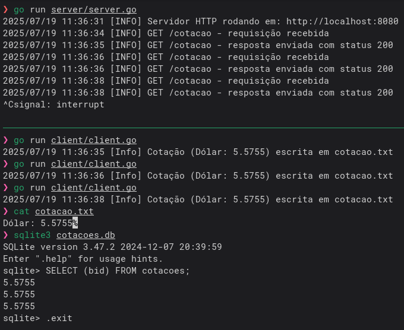

# Estrutura do Projeto

O repositório é dividido em dois microsserviços Go principais:

#### server.go

Atua como um proxy. Ele consome uma API externa (https://economia.awesomeapi.com.br/json/last/USD-BRL) para obter a cotação do dólar, retorna esta cotação para o cliente e persiste os dados da cotação em um banco de dados SQLite, gerando o arquivo `cotacoes.db`.

#### client.go

Realizar uma requisição HTTP para o `server.go` obtendo o valor atual do câmbio e salva essa cotação em um arquivo local `cotacao.txt`.

# Requisitos do Desafio

#### Cliente (client.go):

- Realizar uma requisição HTTP para o **Server** na rota `/cotacao`;
- Receber apenas o valor atual do câmbio (campo **bid** do JSON) retornado pelo **Server**;
- Utilizar `context` com um timeout de **300ms** para a requisição ao **Server**;
- Salvar a cotação recebida no arquivo `cotacao.txt` no formato "Dólar: {valor}";
- Registrar erros nos logs.

#### Servidor (server.go):

- Consumir a API (https://economia.awesomeapi.com.br/json/last/USD-BRL) para obter o câmbio;
- Retornar o resultado para o **Client** no formato JSON, contendo o campo **bid**;
- Persistir cada cotação recebida em um banco de dados SQLite `cotacoes.db`;
- Utilizar `context` com um timeout de **200ms** para a chamada à API externa;
- Utilizar `context` com um timeout de **10ms** para a persistir a cotação no banco de dados;
- Registrar erros nos logs;
- Disponibilizar o endpoint `/cotacao` na porta `8080`.

# Como Rodar o Projeto

Na pasta raiz:

```sh
go run server/server.go
```

Você deverá ver a mensagem: [INFO] Servidor HTTP rodando em: http://localhost:8080

```sh
go run client/client.go
```

Após a execução do cliente, você verá o log de sucesso (ou erro), um arquivo `cotacao.txt` e um banco de dados `cotacoes.db` serão criados/atualizados.

# Resultado Obtido


